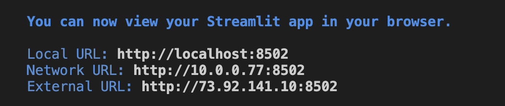
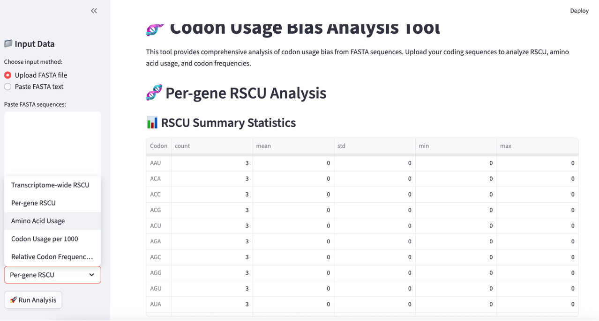

# Codon Usage GUI

A modern, user-friendly Streamlit-based GUI for codon usage bias analysis designed specifically for biologists. This installable Python package provides comprehensive codon usage analysis with interactive visualizations and robust error handling.

## 🔬 Features

**📊 Comprehensive Analysis Types:**
- **Transcriptome-wide RSCU** (Relative Synonymous Codon Usage)
- **Per-gene RSCU analysis** for individual sequence patterns
- **Amino acid usage analysis** (expected vs observed frequencies)
- **Codon usage per 1000 codons** for normalization
- **Relative codon frequencies** per gene

**🎯 User-Friendly Design:**
- **Interactive web interface** - no command line experience needed
- **Robust error handling** with clear, helpful error messages
- **Input validation** to catch common formatting issues
- **Detailed progress feedback** during analysis

**📈 Rich Visualizations:**
- RSCU heatmaps showing codon preference patterns
- Codon usage bar plots with amino acid grouping
- Amino acid usage comparisons (expected vs observed)
- Distribution histograms for bias assessment

**💾 Data Export:**
- Download all results as CSV files
- Multiple output formats for further analysis
- Compatible with Excel, R, Python, and other tools

**🔧 Robust Implementation:**
- Comprehensive input validation and error handling
- Support for both DNA and RNA sequences
- Automatic handling of mixed case and whitespace
- Detailed logging and user feedback

## � Quick Start for Biologists

### Step 1: Download and Install 

**Option A: Clone from GitHub (recommended)**
1. Open Terminal (Mac/Linux) or Command Prompt (Windows)
2. Clone the repository:
   ```bash
   git clone https://github.com/rhondene/Codon-Usage-in-Python.git
   ```
3. Navigate to the project folder:
   ```bash
   cd Codon-Usage-in-Python/codon-usage-gui
   ```
4. Install the package:
   ```bash
   pip install -e .
   ```

**Option B: Download ZIP file**
1. Download this project as a ZIP file from GitHub
2. Extract the ZIP file to your desired location
3. Open Terminal and navigate to the extracted folder:
   ```bash
   cd codon-usage-gui
   ```
4. Install the package:
   ```bash
   pip install -e .
   ```
### Step 2: Launch the Tool
Open your terminal and type:
```bash
codon-usage-gui
```
A web page will automatically open in your browser!
If not, just click on the `Local URL: http://localhost:xxx` to surface the web page


### Step 3: Use the Tool
1. **Upload your FASTA file** using the sidebar (or copy/paste sequences)
2. **Choose analysis type** (start with "Transcriptome-wide RSCU")
3. **Click "Run Analysis"** 
4. **View the interactive plots and results**
5. **Download CSV files** for your records



## 📁 What Files Can I Use?

Your sequences should be in **FASTA format** like this:
```
>gene1
ATGGCTAAGTAG
>gene2
ATGTTTGCCTAG
```

**✅ What works:**
- Coding sequences (CDS) from your organism
- DNA or RNA sequences 
- Files ending in `.fasta`, `.fa`, `.fas`, or `.txt`

**❌ What doesn't work:**
- Genomic DNA with introns
- Protein sequences
- Partial genes (incomplete codons)

## 🧬 Metric Interpretation 

### Understanding RSCU Values
- **RSCU = 1**: Codon used at expected frequency (no bias)
- **RSCU > 1**: Codon used more than expected (preferred)
- **RSCU < 1**: Codon used less than expected (avoided)
- **RSCU >> 1**: Highly preferred codon (typically in highly expressed genes)

### What to Look For
- **Highly expressed genes**: Strong codon bias (high RSCU values)
- **Housekeeping genes**: Moderate codon bias
- **Tissue-specific genes**: Variable bias patterns
- **GC-rich organisms**: Prefer codons ending in G/C
- **AT-rich organisms**: Prefer codons ending in A/T

### Example Use Cases
- Compare codon usage between highly and lowly expressed genes
- Analyze codon optimization for heterologous protein expression
- Study evolutionary pressure on codon usage
- Optimize synthetic gene design

## � Alternative Ways to Run

**Method 1: Web Interface (Easiest)**
```bash
codon-usage-gui
```

**Method 2: Run as Command-line**
```bash
cd codon-usage-gui
python -m codon_usage_gui.cli
```

**Method 3: Import Functions into Jupyter Notebooks**
```python
from codon_usage_gui import parse_fasta_file, compute_rscu_weights

# Your analysis code here
```

## 📚 Need More Help?

- **📖 Detailed Guide**: Check `examples/README.md` for step-by-step instructions
- **📂 Sample Files**: Use files in `examples/` folder to test the tool first
- **🐛 Problems**: Report issues on GitHub

## � What You Need

- **Python 3.10+** (check with `python --version`)
- **Internet connection** (for installation only)
- **Your FASTA files** with coding sequences

## 🆘 Having Problems?

**"Skipped sequences (not multiple of 3)"**
→ Your sequences need complete codons. Check that each sequence length divides by 3.

**"No valid sequences found"** 
→ Make sure your file has headers starting with `>` followed by sequences on the next lines.

**"Command not found: codon-usage-gui"**
→ Try: `python -m pip install -e .` then `codon-usage-gui` again

**Still stuck?** 
→ Check the `examples/` folder for sample files you can test with first!

## 🔬 Citation

If you use this tool in your research, please cite:
`CodonUsageinPython, Rhondene Wint`
